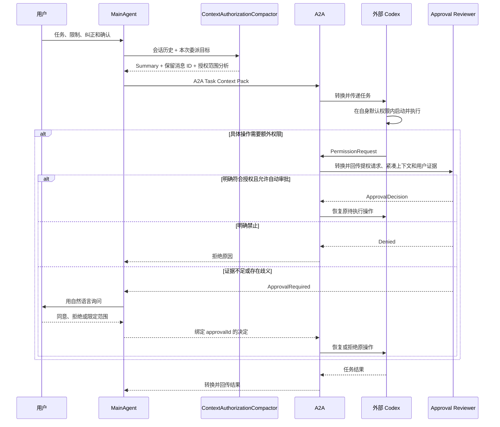

# HuanLink A2A 委派上下文与提权审批设计

> **文档状态：** 分析阶段的设计结论，用于后续 M2 编排与 Codex A2A Adapter 权限回流设计，不授权立即实现。
>
> **范围说明：** 本文讨论本地单用户场景下，MainAgent 如何向外部 A2A Agent 传递可追溯上下文，以及外部 Agent 需要扩大执行权限时如何回到 HuanLink 审批。本文不建设多租户 IAM、组织级 ACL、通用权限平台或完整工作流引擎，也不改变当前 M1 的开发边界。

## 1. 背景与问题

当前真实链路已经能够完成：

```text
用户 / QQ
-> HuanLink MainAgent
-> AgentCall
-> 标准 A2A
-> Codex A2A Adapter
-> 官方 codex app-server
-> 真实 Codex 任务
```

但现有 Demo 路径主要把 MainAgent 生成的自然语言任务作为 A2A `ROLE_USER` 文本发送给 Codex。Codex Adapter 又使用当前本地用户身份执行任务。这带来两个不同层面的问题：

1. **委派语义问题：** 外部 Agent 如何知道用户真正要求了什么、MainAgent 做了哪些解释、哪些限制和确认来自用户原话。
2. **权限审批问题：** 外部 Agent 需要突破当前文件系统、网络、凭据或 Tool 权限时，如何判断这次提权是否被用户授权，而不是 MainAgent 的幻觉或理解错误。

HuanLink 不应要求 MainAgent 在派发前理解远端所有专业细节，例如真实工作目录、具体命令、域名和依赖；这些信息通常只有远端 Agent 和 Adapter 在执行时才能确定。另一方面，也不能把 MainAgent 的一句“用户应该同意”直接当成用户授权。

本文采用的核心思路是：

> 派发前用独立 Compactor 生成可追溯的上下文摘要和授权范围分析；MainAgent 携带摘要、用户原话和权限上限派发 A2A 任务；远端在默认权限内执行，只有实际需要扩大权限时才暂停操作并回传审批请求；HuanLink 再通过自动 Reviewer 或用户自然语言确认完成审批。

## 2. 设计目标

### 2.1 目标

- 外部 Agent 能获得足够但不过量的任务上下文。
- 不使用“最近 N 轮完整对话”作为唯一上下文策略。
- 用 compacted summary 承载长对话中的进度、决定、限制和未决问题。
- 同时保留与任务和授权直接相关的用户原话，避免摘要失真成为唯一依据。
- 把模型生成的“授权分析”和真正可执行的授权凭证严格分开。
- 远端 Adapter 在实际执行边界机械检测提权，而不是依靠 Agent 主动判断危险性。
- 支持 `approve for me`：符合既有用户意图的提权可由独立 Reviewer 自动批准；证据不足时再询问用户。
- 用户通过“可以”“按这个做”等自然语言回复完成审批，不引入复杂权限管理 UI。
- 审批绑定到具体任务、具体请求和具体权限，防止泛化授权、重放和批准后替换操作。

### 2.2 非目标

- 不在本设计中解决多租户、组织角色和跨组织身份联盟。
- 不要求 HuanLink 在派发前列出远端绝对路径或具体 Shell 命令。
- 不建设文件级 ACL、通用策略 DSL 或完整审批中心。
- 不把所有高风险语义操作都转化为用户审批。
- 不保证发现所有“任务语义范围扩大”；本文首先保证执行权限边界的扩大能够被拦截。
- 不替代 Adapter 已有的项目注册、工作目录、分支、并发和自动化限制。

## 3. 核心设计原则

### 3.1 用户原话、模型解释和真实授权分层

三类信息必须有不同的可信语义：

| 信息 | 产生者 | 用途 | 能否直接授权 |
| --- | --- | --- | --- |
| `user_evidence` | HuanLink 从会话记录机械提取 | 证明用户真正说过什么 | 不能单独执行，需绑定具体审批 |
| `context_summary` / `authorization_analysis` | Compactor Agent | 帮助理解任务和授权范围 | 不能 |
| `delegation_interpretation` | MainAgent | 说明本次委派目标和理由 | 不能 |
| `authority_ceiling` | HuanLink 配置与用户选择 | 限制允许扩展到的最高能力 | 是硬上限，但不是具体操作批准 |
| `approval_decision` | Reviewer 或用户，经 HuanLink 绑定到待审批请求 | 决定一个具体提权请求 | 可以，但只能恢复 Adapter 服务端保存的原待执行操作 |

任何模型都可以提出解释和建议，但不能凭自己的输出制造用户授权。

### 3.2 Summary 是上下文事实，不是 System 指令

`context_summary` 描述旧对话、任务状态和用户限制。它可能压缩失真，因此不能放进 System Prompt，也不能获得高于用户原话的优先级。

稳定的 System / Developer Prompt 只描述：

- A2A 委派协议和字段语义；
- Summary、用户证据和审批决定的可信边界；
- 提权请求格式；
- Adapter 与 Reviewer 的安全规则；
- 禁止绕过审批和替换已批准操作。

每个任务变化的 Summary、用户原话和授权分析作为动态 A2A Message / Data Part 发送。

### 3.3 提权触发基于能力边界，不基于“危险”标签

结构化审批请求的触发条件是：

> 具体 Tool Call 所需权限没有被当前有效权限覆盖。

执行层应机械比较文件系统、网络、凭据和 Tool 权限。当前权限已覆盖的操作直接执行；需要额外权限时暂停并回传审批请求。

危险程度可以影响 Reviewer 是否批准，但不应由执行 Agent 自由决定是否进入审批流程。

### 3.4 默认权限由运行边界拥有

Codex 的项目、Workspace、工作目录、Sandbox、分支和执行模型属于 Codex A2A Adapter。MainAgent 不应持有这些 Agent 专属配置。

HuanLink 可以发送抽象的执行模式和最高权限类别，远端 Adapter 负责把它映射到真实路径、域名和 Tool 能力。实际有效权限取各层约束的交集：

```text
effective_authority
= adapter_hard_policy
  ∩ requested_execution_profile
  ∩ approved_escalations
```

任何一层都只能收紧，不能绕过另一层的限制。

## 4. 总体流程

本节用 `A2A` 表示任务、审批输入和结果的协议与转换层；`外部 Codex` 表示接收 A2A 任务后实际执行工作的 Agent。具体的 Codex A2A Adapter 是这条 A2A 转换链路在 Codex 侧的实现，不在总体图中单独展开。



## 5. 派发前的 Context Compaction

### 5.1 Compactor 是专用模型调用，不是执行 Agent

`ContextAuthorizationCompactor` 是一次没有 Tool、没有执行权限的专用模型调用。它可以使用与 MainAgent 相同或更低成本的模型，但必须使用稳定的 Compact Prompt 和结构化输出。

它不是一个长期运行的子 Agent Thread，也不负责执行任务。它只把当前会话压缩成外部 Agent 可以消费的交接上下文。

该设计学习 Codex compaction 的以下做法：

- 压缩指令作为动态用户侧输入，而不是修改 System Prompt；
- 原始会话和稳定 Base Instructions 作为压缩调用的前缀；
- 模型生成 handoff summary；
- 新 Active Context 由 Summary 与选中的原始用户消息组成；
- Raw Log 保持完整，Summary 只是新的模型可见快照。

Codex 的本地实现会在压缩后保留一个 token 预算内的较新用户消息。HuanLink 不应原样复制“只从后往前保留”的策略，而应让 Compactor 按任务和授权相关性返回 `retained_message_ids`，再由程序提取原文。

### 5.2 Compactor 输入

```text
稳定 Compact Prompt
+ 当前会话中可用于本次委派的历史
+ MainAgent 准备委派的目标
+ 输出 Schema
```

Compact Prompt 应要求输出：

- 当前任务目标；
- 已有进展和关键决定；
- 明确限制和用户偏好；
- 未决问题与不能擅自假设的事项；
- 与任务直接相关的原始消息 ID；
- 用户明确允许、明确禁止和仍不确定的范围；
- 每项授权判断对应的证据消息 ID。

### 5.3 Compactor 输出

```json
{
  "taskSummary": {
    "goal": "用户希望完成的结果",
    "progress": [],
    "decisions": [],
    "constraints": [],
    "openQuestions": []
  },
  "retainedMessageIds": [
    "msg-current-request",
    "msg-user-correction",
    "msg-user-confirmation"
  ],
  "authorizationAnalysis": {
    "explicitlyAllowed": [
      {
        "scope": "用户明确允许的目标或操作类别",
        "evidenceMessageIds": ["msg-user-confirmation"]
      }
    ],
    "explicitlyDenied": [],
    "implicitlyExpected": [],
    "uncertain": []
  }
}
```

### 5.4 原始消息由程序提取

Compactor 只能选择消息 ID，不能负责复制用户原话。HuanLink 根据 `retainedMessageIds` 从原始会话记录机械提取：

- 用户当前任务原话；
- 用户对 MainAgent 的纠正；
- 用户明确同意或拒绝的消息；
- 用户明确限制；
- 与本次任务仍然相关的未决问题。

每条证据至少保留：

```text
messageId
role
text
timestamp
conversationId / channel source
```

如果 Compactor 返回不存在、越权或不属于当前会话的消息 ID，Context Pack 构建失败，不能自动降级为“相信摘要”。

### 5.5 Prompt Cache

本设计不为每个任务动态修改 System Prompt。稳定协议和安全规则位于提示前缀；会话历史、Compact Prompt、Summary 和 A2A Task 位于动态后缀。

Compaction 调用可以复用“稳定 Base Instructions + 已有会话历史”的前缀缓存。压缩后旧历史被替换，旧历史部分的缓存不再适用，但稳定 System / Developer Instructions 仍可继续命中。Summary 变化不会使前面的稳定提示整体失效。

## 6. A2A Task Context Pack

MainAgent 获得 Compactor 输出后，构造以下任务包：

```text
A2A Task
├─ task
│  ├─ goal
│  │  └─ 希望外部 Agent 最终完成什么结果
│  ├─ deliverables
│  │  └─ 期望返回的代码、报告、结论或其他产物
│  └─ success_criteria
│     └─ MainAgent 判断任务完成的条件
│
├─ context_compaction
│  ├─ context_summary
│  │  └─ Compactor 生成的任务背景、当前状态和关键决定
│  ├─ constraints
│  │  └─ 用户限制、已确认边界和需要避免的行为
│  ├─ open_questions
│  │  └─ 当前仍不明确、不能擅自假设的事项
│  └─ retained_message_ids
│     └─ 随任务保留的原始消息 ID
│
├─ user_evidence
│  ├─ current_request
│  │  └─ 用户当前任务原话 + messageId + 时间
│  ├─ confirmations
│  │  └─ “可以”“按这个做”等明确确认的原话
│  ├─ corrections
│  │  └─ 用户对 MainAgent 理解进行纠正的原话
│  └─ restrictions
│     └─ 用户明确限制的原话
│
├─ authorization_analysis
│  ├─ explicitly_allowed
│  │  └─ 用户明确允许的目标或操作类别 + evidenceMessageIds
│  ├─ explicitly_denied
│  │  └─ 用户明确禁止的目标或操作类别 + evidenceMessageIds
│  ├─ implicitly_expected
│  │  └─ 完成任务通常需要、但用户没有逐项说明的操作
│  └─ uncertain
│     └─ 无法确认是否获得授权、提权时必须重新审核的范围
│
├─ delegation_interpretation
│  ├─ main_agent_understanding
│  │  └─ MainAgent 对任务目标和用户意图的理解
│  ├─ delegation_reason
│  │  └─ 为什么将任务交给该外部 Agent
│  └─ confidence
│     └─ MainAgent 对当前理解的置信度及已知歧义
│
├─ execution_policy
│  ├─ requested_profile
│  │  └─ adapter-default / read-only / workspace-write
│  ├─ approval_mode
│  │  └─ ask-user / approve-for-me
│  └─ authority_ceiling
│     ├─ filesystem
│     │  └─ 允许扩展到的最高文件系统权限；可使用 workspace://current 等符号范围
│     ├─ network
│     │  └─ 允许申请或自动批准的最高网络权限
│     ├─ credentials
│     │  └─ 是否允许申请或使用凭据
│     └─ tools
│        └─ 允许使用的 Tool 或 Connector 上限
│
└─ provenance
   ├─ conversation_id
   │  └─ 用户会话来源
   ├─ parent_task_id
   │  └─ HuanLink 主任务 ID
   ├─ a2a_task_id
   │  └─ 本次 A2A 委派任务 ID
   ├─ delegated_by
   │  └─ 发起委派的 MainAgent
   ├─ compacted_by
   │  └─ 生成摘要和授权分析的 Compactor
   ├─ target_agent
   │  └─ 接收任务的外部 Agent
   └─ created_at
      └─ 任务包生成时间
```

### 6.1 A2A 承载方式

自然语言任务仍作为标准 A2A Message 文本内容传递。结构化 Context Pack 放入标准 Message 的 Data Part 或 metadata，不新增独立传输协议。

字段应带版本，例如：

```json
{
  "schema": "huanlink.delegation-context/v1",
  "task": {},
  "contextCompaction": {},
  "userEvidence": {},
  "authorizationAnalysis": {},
  "delegationInterpretation": {},
  "executionPolicy": {},
  "provenance": {}
}
```

外部 Agent 不识别该扩展时仍能读取自然语言任务，但必须退化为默认权限和人工审批模式，不能因为忽略授权字段而获得更大权限。

## 7. 初始权限与授权范围分析

### 7.1 两种“权限”必须分开

`authorization_analysis` 回答：

> 从用户对话看，用户明确允许、禁止或尚未决定什么？

Adapter 的权限配置回答：

> 当前机器上，这个 Agent 实际能读取、写入、联网和调用什么？

前者是语义证据，后者是机械执行边界。Compactor 可以生成前者，不能生成后者。

### 7.2 初始权限不由模型推导

任务开始时，Codex Adapter 根据自身配置和用户选择加载默认 Profile，例如：

| 用户模式 | Adapter 行为 |
| --- | --- |
| `ask-user` | 在默认 Sandbox 内执行，提权时回到用户 |
| `approve-for-me` | 使用相同 Sandbox，提权时交给独立 Reviewer |
| `full-access` | 仅在用户显式启用且本地策略允许时使用更宽 Profile |

改变审批者不能扩大 Sandbox。`approve-for-me` 只是把原本由用户审核的提权请求交给 Reviewer，不改变文件系统、网络和受保护路径上限。

### 7.3 HuanLink 不需要理解远端绝对路径

`authority_ceiling` 可以使用抽象范围：

```text
workspace://current
project://registered
network://dependency-registry
credentials://none
```

远端 Adapter 把这些范围解析为真实路径、域名和凭据策略，并回报自己的 `effective_authority`。如果无法解析，按更严格权限运行或拒绝任务，不能自行扩大解释。

## 8. 远端提权与审批回流

### 8.1 提权检测

当外部 Agent 发起具体 Tool Call 时，执行层计算所需权限：

```text
required_authority(operation)
        是否被 effective_authority 覆盖？
                  /             \
                是               否
              直接执行       暂停并生成审批请求
```

典型提权包括：

- 写入当前可写根以外的路径；
- 访问当前禁止的网络目标；
- 使用尚未授权的凭据；
- 调用需要审批的 MCP / App Tool；
- 请求额外文件系统或进程能力。

### 8.2 A2A ApprovalRequired

```text
A2A ApprovalRequired
├─ approval_id
│  └─ 本次待审批请求的唯一 ID
├─ a2a_task_id
│  └─ 对应的 A2A 任务
├─ requested_by
│  └─ 发起具体操作的外部 Agent
│
├─ pending_operation
│  ├─ tool
│  │  └─ 准备调用的 Tool
│  ├─ operation
│  │  └─ 准备执行的准确操作
│  ├─ resolved_targets
│  │  └─ Adapter 解析出的实际文件、目录、域名或资源
│  └─ reason
│     └─ 为什么完成任务需要该操作
│
├─ permission_escalation
│  ├─ current_authority
│  │  └─ 当前有效权限
│  ├─ requested_authority
│  │  └─ 本次希望增加的权限
│  └─ escalation_difference
│     └─ 相比当前权限具体扩大了什么
│
├─ approval_context
│  ├─ context_summary
│  │  └─ 原 A2A Task 中的压缩摘要
│  ├─ authorization_analysis
│  │  └─ 派发前生成的授权范围分析
│  └─ relevant_user_evidence
│     └─ 与本次提权直接相关的用户原话
│
└─ request_lifecycle
   ├─ status
   │  └─ pending / approved / denied / consumed / expired
   └─ expires_at
      └─ 审批请求有效期
```

V1 不把待执行操作重新放进批准消息。Adapter 在服务端保存原始待审批请求，HuanLink 只使用 `approvalId` 返回决定，因此不需要用操作哈希防止批准后替换内容。

### 8.3 A2A 状态映射

A2A v1 没有通用的 Agent 执行提权语义。该场景不是 OAuth 身份认证，因此不应复用 `AUTH_REQUIRED` 表达普通 Sandbox 提权。

第一版可以采用：

```text
Task state: input-required
Message/Data Part schema: huanlink.approval-required/v1
```

任务保持非终态并等待输入。批准或拒绝后，HuanLink 使用同一 Task / Context 发送结构化决定，Adapter 恢复或结束被暂停的操作。

### 8.4 自动 Reviewer

`approve-for-me` 使用独立 Reviewer Agent，而不是让执行 Agent 或 MainAgent 自己批准。

Reviewer 只看到：

- 紧凑任务摘要；
- 与审批直接相关的用户原话；
- 派发前授权分析；
- 当前权限；
- 精确提权请求和解析后的目标；
- HuanLink 硬性策略上限。

Reviewer 的决策规则：

| 判断 | 处理 |
| --- | --- |
| 明确符合用户授权，且未超过自动审批上限 | 自动批准 |
| 明确违反用户限制或硬性策略 | 拒绝 |
| 证据不足、冲突或范围发生实质变化 | 询问用户 |

Reviewer 输出理由，但不能修改待执行操作。批准后，HuanLink 只把绑定 `approvalId` 的结构化决定返回 Adapter。

### 8.5 用户自然语言确认

MainAgent 把审批请求转换为用户可理解的问题。用户可以用自然语言回复：

```text
可以
按这个做
只允许访问 npm registry，不要访问其他网络
不可以，换一个不联网的方案
```

HuanLink 必须把回复绑定到当前 `approvalId`。单独出现的“可以”不能保存成永久或跨任务授权。

如果存在多个待审批请求，MainAgent 必须明确用户回复对应哪一个请求；无法唯一绑定时继续询问，不能猜测。

### 8.6 服务端待审批状态与 ApprovalDecision

```text
PendingApproval（Adapter 内部）
├─ approval_id
├─ a2a_task_id
├─ original_request
├─ requested_authority
├─ status
│  └─ pending / approved / denied / consumed / expired
├─ created_at
└─ expires_at

ApprovalDecision（HuanLink -> Adapter）
├─ approval_id
├─ decision
│  └─ approved / denied
├─ decision_source
│  └─ auto-review / user-message
├─ evidence_message_ids
└─ decided_at
```

Adapter 只在以下条件全部成立时恢复操作：

- `approvalId` 对应当前暂停请求；
- 待审批记录仍是 `pending` 且没有过期；
- 原始请求仍由 Adapter 服务端持有；
- 批准没有超过 Adapter 硬性策略；
- 当前 Task / Agent / Context 与待审批记录一致。

批准后，Adapter 原子地把记录从 `pending` 转为 `consumed`，并且只恢复自己保存的原操作。操作内容或目标发生变化时必须创建新的待审批请求。

V1 明确不签发可携带的 ApprovalGrant，不计算 `operation_hash`，也不使用 HMAC 或私钥签名。签名只在未来出现跨信任域转发、无状态验证、多实例独立验签等真实需求时重新评估。

## 9. 权限范围扩大与任务范围扩大

本文机制能够可靠检测执行能力边界扩大，但不能自动保证发现所有任务语义偏移。

例如用户要求修改项目 A，而外部 Agent 修改同一可写 Workspace 内的项目 B。如果两者都落在当前 `workspace-write` 范围内，就没有发生机器权限提升，执行层不会天然触发审批。

因此需要明确：

| 类型 | 第一版控制方式 |
| --- | --- |
| 文件系统、网络、凭据、Tool 权限扩大 | Adapter 机械拦截并回传审批 |
| MainAgent 或外部 Agent 对用户意图理解错误 | Summary + 用户原话 + 限制条件 + 结果 Review |
| 当前可写范围内的语义越界 | 依靠任务约束、Adapter 项目边界和最终 Review；不承诺全部拦截 |
| 删除、发布、发消息等范围内高影响操作 | 若产品要求始终审批，需要未来拆分独立能力或增加 Tool Hook |

如果未来要求“删除文件始终确认”，就不能只使用粗粒度 `filesystem.write`；需要引入 `filesystem.delete`、PreToolUse Hook 或 Adapter Tool 策略。该扩展不属于本文第一版范围。

## 10. 失败与降级策略

### 10.1 Compactor 失败

- 不使用不完整或无法校验的 Summary 自动派发高权限任务。
- 可以降级发送“当前用户请求原话 + 明确限制”，但 `authorization_analysis` 标记为未知。
- 降级任务使用 Adapter 默认权限；任何提权回到用户，不允许自动 Reviewer 根据缺失摘要推断授权。

### 10.2 用户证据校验失败

- 消息 ID 不存在、跨会话或文本不匹配时，Context Pack 构建失败。
- 不能用模型生成的引文替代原始消息。

### 10.3 Reviewer 不可用

- `approve-for-me` 降级为询问用户。
- 无法触达用户或没有交互通道时拒绝提权，任务保持等待或失败，不得默认批准。

### 10.4 A2A 断线或超时

- 被暂停操作保持未执行状态。
- Adapter 通过 `approvalId + pending -> consumed` 状态转换保证幂等消费。
- 重连后先查询 Task 和审批状态，不能重新执行未知状态的操作。

### 10.5 拒绝后的行为

- 把拒绝理由返回外部 Agent。
- Agent 可以寻找权限更小的替代方案。
- 禁止通过等价命令、间接 Tool 或拆分操作绕过同一拒绝。
- 如果无法找到更安全方案，停止并回到 MainAgent / 用户。

## 11. 审计与可观测性

第一版至少记录：

```text
delegation.context_compacted
delegation.task_submitted
approval.requested
approval.auto_reviewed
approval.user_requested
approval.decided
approval.consumed
approval.expired
approval.failed
```

每个事件至少关联：

```text
conversationId
parentTaskId
a2aTaskId
approvalId
requestingAgent
targetAdapter
evidenceMessageIds
decisionSource
result
```

Raw EventLog 保存完整事实；A2A Context Pack 和 Reviewer Context 是从 Raw Log 派生的模型可见快照。Replay 时应复用当时实际发送的 Context Pack、ApprovalDecision 和待审批状态，不应重新调用模型生成不同摘要或重新解释授权。

## 12. 与当前 HuanLink 文档的关系

- `13-context-compaction-reference-analysis.md` 提供 Raw Log、Active Context、Summary Role 和 Compaction Checkpoint 的研究基础。本文把该机制应用到 A2A 委派前的 Context Pack。
- `23-a2a-first-real-demo-plan.md` 是已完成真实 QQ -> MainAgent -> A2A -> Codex 闭环的基线。本文不修改该 Demo 结论。
- `24-huanlink-v1-product-requirements-draft.md` 当前明确暂缓“完整审批中心和权限回流”。本文是后续设计输入，不自动把它加入当前 v1.0 实现范围。
- `26-huanlink-v1-development-plan.md` 的 M2 要求确认“哪些判断交给模型、哪些约束由 HuanLink 机械保证”和“多步骤任务的最小上下文与结果传递语义”。本文为这两个问题提供候选答案，但不授权跳过 M1。

## 13. 当前实现差距

截至本文编写时，真实链路与目标设计存在以下差距：

1. A2A Client 提交的主要是 `ROLE_USER` 自然语言文本，尚未携带本文定义的 Context Pack。
2. Codex Adapter 启动 Thread 时使用 `approvalPolicy: "never"` 和 `sandbox: "workspace-write"`，不会形成可回流的提权审批。
3. Adapter 当前主要处理 Codex `requestUserInput`，尚未把命令执行、文件修改和额外权限审批映射成 A2A `input-required`。
4. HuanLink 尚无 ContextAuthorizationCompactor、Approval Broker 和自动 Reviewer 组合。
5. 当前 EventLog 未覆盖 Context Pack、审批请求、ApprovalDecision 和审批消费状态。

这些差距只用于说明未来设计工作，不应在当前 M1 中提前实现。

## 14. 分阶段建议

### 阶段 A：委派上下文

- 定义 `huanlink.delegation-context/v1`。
- 增加专用 Compactor 调用和结构化输出校验。
- 根据消息 ID 提取用户原话。
- MainAgent 派发 Summary + 用户证据 + 授权分析。
- 暂不自动批准提权。

### 阶段 B：提权回流

- Codex Adapter 使用可交互审批策略。
- 拦截 app-server 的权限审批请求。
- 映射为 A2A `input-required + huanlink.approval-required/v1`。
- 绑定用户自然语言回复并恢复原操作。
- 增加服务端待审批状态、过期、单次消费和审计。
- V1 不实现可携带授权凭证、操作哈希或签名验签。

### 阶段 C：Approve for me

- 增加独立 Approval Reviewer。
- 定义自动批准硬上限和拒绝规则。
- Reviewer 不确定时回到用户。
- 对自动批准率、误拒绝、用户追问率和权限越界进行真实验证。

每个阶段都需要单独的聚焦设计和实施计划，不能以本文替代 Dxx 计划。

## 15. 验证要求

后续实现至少需要覆盖：

### 15.1 Context Pack

- Summary 不进入 System Prompt。
- Compactor 只能引用当前会话中的真实消息 ID。
- 用户原话由程序提取，不由模型改写。
- 明确允许、禁止和不确定范围都保留证据 ID。
- 长会话下不依赖最近 N 轮完整历史。

### 15.2 权限检测

- 当前权限覆盖的操作不会错误触发审批。
- 文件系统、网络、凭据和 Tool 权限扩大能够稳定触发审批。
- Adapter 无法解析抽象权限范围时不会扩大权限。

### 15.3 审批回流

- 同意、拒绝和限定范围的自然语言回复能够绑定正确 `approvalId`。
- 多个待审批请求下，模糊回复不会被错误绑定。
- 操作内容或目标变化后必须创建新的待审批请求。
- 过期、已消费和跨任务审批决定被拒绝。
- 断线恢复不会重复执行已消费的待审批操作。

### 15.4 自动 Reviewer

- 明确授权且在硬上限内的请求能够自动批准。
- 明确禁止、凭据外传、持久安全削弱和高不可逆风险请求被拒绝。
- 用户证据冲突或不足时回到用户。
- Reviewer 失败或不可用时不会默认批准。

### 15.5 真实链路

单元测试只能证明字段映射和策略逻辑。完成声明仍需要真实：

```text
用户自然语言任务
-> MainAgent
-> Context Compaction
-> A2A Codex Task
-> Codex 触发真实提权
-> HuanLink 自动或人工审批
-> Codex 恢复原操作
-> 结果回流原会话
```

并用日志证明 Context Pack、A2A Task、Codex Thread / Turn、Approval ID、ApprovalDecision 和最终结果可以关联。

## 16. 已确认结论与实施前待确认项

### 16.1 已确认结论

- 使用独立 Compactor 生成 handoff summary，不使用最近 N 轮完整对话作为唯一上下文。
- Summary 与部分关键用户原话一起发送。
- Summary 和授权分析都不进入 System Prompt。
- Compactor 同时生成任务授权范围分析，并为每项判断绑定消息 ID。
- MainAgent 获取 Context Pack 后派发 A2A Task。
- 初始执行权限来自远端 Adapter，而不是模型分析。
- 只有实际提权时才生成结构化审批请求。
- `approve-for-me` 使用独立 Reviewer，不能由执行 Agent 自批。
- 证据不足时由 MainAgent 询问用户，用户自然语言回复绑定具体审批请求。
- Adapter 是最终执行点，并通过服务端待审批状态恢复原操作。
- V1 不实现 ApprovalGrant、`operation_hash` 或审批签名；使用 `approvalId`、服务端原请求和状态转换完成绑定与单次消费。

### 16.2 进入聚焦设计前需要确认

以下问题不影响本文架构成立，但必须在对应 Dxx 设计中做出明确选择：

1. Compactor 使用 MainAgent 当前模型、独立低成本模型，还是由 Provider 配置决定。
2. Context Pack 的最大 token 预算以及关键消息选择上限。
3. `authority_ceiling` 第一版支持哪些抽象能力类别。
4. A2A SDK 对 `input-required` 和结构化 Data Part 的具体映射方式。
5. 单会话允许同时存在多少待审批请求，以及自然语言回复的绑定交互。
6. 第一版自动 Reviewer 的硬拒绝类别和可自动批准上限。

## 17. 参考资料

- `docs/dev/13-context-compaction-reference-analysis.md`
- `docs/dev/23-a2a-first-real-demo-plan.md`
- `docs/dev/24-huanlink-v1-product-requirements-draft.md`
- `docs/dev/26-huanlink-v1-development-plan.md`
- `references/codex/codex-rs/core/src/compact.rs`
- `references/codex/codex-rs/core/src/compact_remote.rs`
- `references/codex/codex-rs/core/src/compact_remote_v2.rs`
- `references/codex/codex-rs/core/src/tools/handlers/multi_agents_common.rs`
- `references/codex/codex-rs/core/src/tools/handlers/mod.rs`
- [Codex Subagents](https://learn.chatgpt.com/docs/agent-configuration/subagents.md)
- [Codex Auto-review](https://learn.chatgpt.com/docs/sandboxing/auto-review.md)
- [OpenAI Prompt Caching](https://developers.openai.com/api/docs/guides/prompt-caching)

## 18. 暂停研究的后续问题

以下问题已经超出本文当前要解决的“委派上下文与提权回流”范围，也超出当前阶段适合承担的工程复杂度。本文只记录问题，不给出已确认方案，不把它们纳入 V1 或当前 M1 实现。

### 18.1 多个并行工作流与当前焦点

- 同一个 HuanLink 用户会话允许存在多个 Codex 工作流时，如何维护“当前焦点任务”。
- 用户的普通补充消息如何判断属于当前工作流、其他已有工作流，还是一个新任务。
- 正在执行、等待输入、已完成但可继续等状态如何影响续接判断。
- 上次通信时间只能作为辅助信号，不能单独决定任务边界。

### 18.2 A2A Task、A2A Context、HuanLink 工作流和 Codex Thread 的关系

- 一次 A2A Task 更接近一次具体执行；同一个长期目标可能产生多个 A2A Task。
- A2A Context 可以连接多次执行，但不应未经设计就等同于 HuanLink 工作流或 Codex Thread。
- 需要明确 `workstreamId`、`a2aTaskId`、`a2aContextId`、`projectId`、`codexThreadId` 的持久化映射、生命周期和唯一性约束。
- 当前 Adapter 的 `contextId -> Codex threadId` 主要是进程内关系，不能据此声称已经支持持久化恢复或旧会话接入。

### 18.3 刚接入 HuanLink 时导入既有 Codex 会话

- 用户可能明确要求继续一个早已存在、但尚未经过 HuanLink 创建的 Codex Thread。
- 该场景不是“继续已有 A2A Task”，而是把外部 Codex Thread 绑定为新的 HuanLink 工作流，再创建新的 A2A Task。
- Adapter 需要把可用项目和 Codex 会话做成可查询能力，并验证目标 Thread 确实属于已注册项目。
- 既有 Thread 的历史可以作为任务上下文，但不能自动变成当前 HuanLink 会话的用户授权证据，也不能自动继承过去的 `full` 或其他执行授权。

### 18.4 高效查询与候选召回

- 优先通过当前焦点和持久化绑定走确定性查询，避免每条消息扫描全部历史。
- 只有用户明确指定旧任务、当前焦点不匹配或本地绑定缺失时，才查询 Adapter 的项目和 Thread 目录。
- 候选查询应先使用项目、状态、更新时间、Thread ID、标题和预览等结构化条件，只向模型提供少量候选卡片，而不是完整历史。
- 需要研究按需导入、本地元数据缓存、分页同步、全文检索以及缓存失效策略；第一版是否需要语义向量检索尚未决定。
- 多个候选无法唯一判断时，应询问用户，不能为了自动续接而猜测。

### 18.5 上下文稀释与长期锚点

- 如果任务摘要被反复重写，早期目标、长期约束和关键决定可能逐渐被稀释。
- 需要研究是否把任务目标、明确限制、当前进度、下一步和未决问题拆成不同字段，并对目标与限制设置受保护锚点。
- HuanLink 用于路由的摘要与 Codex Thread 自己的执行上下文应保持不同职责，不能用一份短摘要替代远端完整或已 Compact 的会话状态。
- 旧 Thread 首次导入时由哪一侧生成摘要、读取多少历史、如何分页以及如何校验摘要，尚未决定。

### 18.6 暂停边界

这些问题先保留到未来独立研究和聚焦 Dxx 设计。进入实现前必须重新检查当时的 HuanLink 里程碑、Codex app-server 查询能力、持久化方案和真实使用规模；在此之前不增加数据库表、索引、Thread 同步、任务路由模型或旧会话导入代码。
